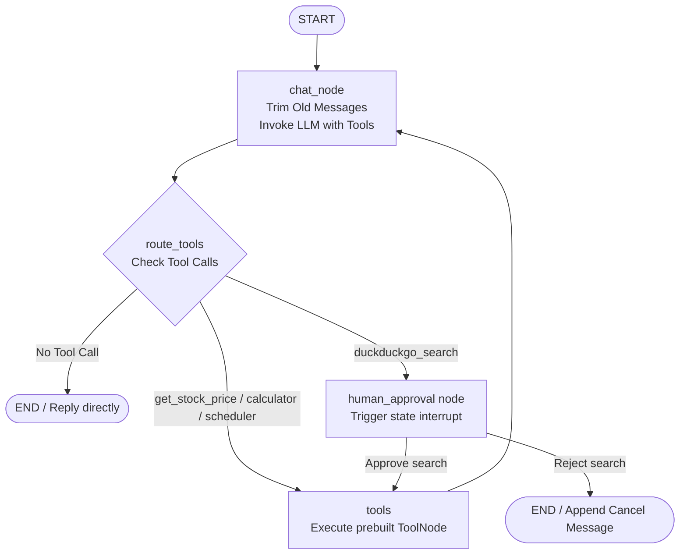

# Production-Grade LangGraph AI Assistant Platform

An enterprise-ready, multi-tool AI Assistant Platform engineered using **LangGraph**, **LangChain**, and **FastAPI**, accompanied by a state-of-the-art **React + Vite** web dashboard. 

This platform showcases advanced AI agent patterns, including **Short-Term Memory Budgeting (Trimming)**, **State Persistence (Checkpointing)**, **Semantic Retrieval-Augmented Generation (RAG)**, **Tool-calling Telemetry**, and **Human-in-the-Loop (HITL) Gateways**.

---

## 🌟 Platform Capabilities

*   **State Machine Architecture (LangGraph)**: Models complex agent logic using cyclical state graphs, conditional routing, and deterministic prebuilt ToolNodes.
*   **Human-in-the-Loop (HITL) Gateways**: Dynamically pauses state executions (using LangGraph `interrupt` logic) when the agent requests external actions (e.g., Live Web Search), prompting users for approval or rejection in real-time before resuming.
*   **Factual Q&A Engine (RAG)**: Integrates a vector database engine utilizing **Chroma** and **Google Gemini Embeddings** (`gemini-embedding-001`) to search, retrieve, and cite relevant source passages and page numbers from a research paper on YOLO melanoma cell classification.
*   **Centralized State & Multi-threading**: Leverages an SQLite checkpointer (`SqliteSaver`) to save and resume conversations, supporting thread-specific histories, session persistence, and seamless interrupt recovery.
*   **Short-Term Memory Budgeting**: Enforces strict token-budget limits (`MAX_TOKEN_BUDGET=150` by default) by trimming older messages from the active LLM context inside the graph nodes, preventing unbounded DB growth and token overflow.
*   **Polished React Web Dashboard**: A futuristic glassmorphic UI built with **React** and **Lucide Icons**, featuring:
    *   **Live Token Streaming**: Word-by-word streaming of agent completions via Server-Sent Events (SSE).
    *   **Tool Execution Cards**: Collapsible visualization panels showing active tool parameters and live return payloads.
    *   **Citations Inspector**: Expandable drawers showing source text passages and document page numbers.
    *   **Interactive HITL Modals**: Modal prompts allowing users to approve or reject search queries with one click.
    *   **Productivity Exports**: Direct click-to-download buttons serving daily schedules compiled into custom ReportLab PDFs.

---

## 📐 System Architecture

The following diagram visualizes the LangGraph state machine transitions, routing conditions, and the human approval gateway:



---

## 🛠️ Tech Stack

*   **Backend**: Python 3.10+, LangGraph, LangChain, FastAPI, ChromaDB, ReportLab PDF, PyPDF, SQLite, Uvicorn, Pydantic Settings.
*   **Frontend**: React (Vite), Vanilla CSS (HSL dark mode, glassmorphism), Lucide React, Server-Sent Events (SSE) Reader.
*   **Environment Manager**: `uv` package manager (or standard `pip`).

---

## 🚀 Getting Started

### 1. Environment Setup

Clone this repository and create a `.env` configuration file in the project root:

```bash
cp .env.example .env
```

Open `.env` and fill in your API credentials:

```ini
MISTRAL_API_KEY=your_mistral_api_key
GOOGLE_API_KEY=your_google_api_key
```

### 2. Backend Package Installation

This project utilizes `uv` for lightning-fast environment setups. Install the backend package in editable mode:

```bash
# Installs all required packages and binds the local package
uv pip install -e .
```

*(Alternatively, if utilizing standard virtualenvs: `pip install -e .`)*

### 3. Run RAG Document Indexing

Initialize the Chroma vector store by semantic-indexing the Melanoma Research Paper PDF:

```bash
python run.py index
```

### 4. Run Test Suite

Verify configurations, tool utilities, and graph transitions using `pytest`:

```bash
pytest
```

---

## 💻 Running the Applications

### Option A: Interactive Terminal CLI

Run the fully featured command-line chat session. You can list, create, and resume previous thread sessions directly on the console, with in-line search approvals:

```bash
python run.py cli
```

### Option B: Web UI Workspace (Recommended)

To run the beautiful React dashboard:

1.  **Launch Backend API Server**:
    ```bash
    python run.py api
    ```
    The FastAPI backend will start running at `http://127.0.0.1:8000`.

2.  **Launch React Frontend Dev Server**:
    ```bash
    cd frontend
    npm run dev
    ```
    Open `http://localhost:5173` in your browser to view the workspace dashboard.

---

## 📡 Backend REST API Specifications

The FastAPI server exposes clean endpoints to communicate with the web dashboard:

| Method | Endpoint | Description | Payload Structure |
| :--- | :--- | :--- | :--- |
| `GET` | `/api/status` | Verifies server and RAG document status. | *None* |
| `GET` | `/api/threads` | Lists all distinct thread IDs stored in SQLite. | *None* |
| `POST` | `/api/index` | Triggers on-demand vector indexing of the PDF. | *None* |
| `POST` | `/api/chat` | Streams agent tokens and tool events via SSE. | `{"thread_id": "...", "message": "..."}` |
| `POST` | `/api/approve` | Submits human approval decisions to resume execution. | `{"thread_id": "...", "approved": "yes\|no"}` |
| `GET` | `/api/pdf/{file}` | Serves generated schedule PDFs for direct download. | *Path Parameter: file name* |

---

## 🧪 Testing Coverage

The package includes a comprehensive testing harness under `tests/` validating:
*   **Calculator Math Limits**: Safe division by zero, floating points, unsupported operations.
*   **Configuration Security**: Seamless Pydantic loading, relative path resolutions, fallback behaviors.
*   **Graph Transitions**: Router logic confirming direct replies go to `END`, search requests hit `human_approval`, and math/finance route immediately to `tools`.
